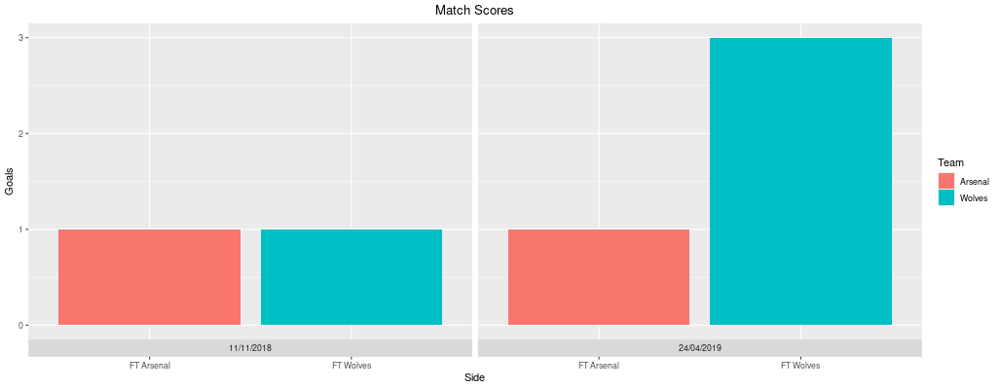

## English Premier League 2018-19 Match Data

### Packages :
tidyverse  
ggrepel  
shiny  
shinythemes  

### Description
The English Premier League is one of the most popular and respected leagues in the world. There are a total of 20 teams in the league that face each other twice a year, one at home and the other away. In the web app script below, we use reactive programming to gather data on two user selected teams. We find the two weeks in which they played and gather the half time and full time goal count for each game. We also have a comparitive model to describe the performance of the two teams to the rest of the league in a scatterplot that shows the goals scored to goals allowed ratio. 

The built web app can also be found on the shiny server here at this [link](https://kalsangsherpa.shinyapps.io/1819EPLMatchInfo/) 

### Plot 1:
Displays the fulll time score in the two games that the two teams met each other. The graph used is a bar chart and shows a side by side comparison of match 1 full time score and match 2 full time score. Automatically updates upon new selections 

### Plot 2: 
Displays the full week goal scored count for the two teams. Red and blue are used to depict the colors of the two teams. With the line graph it's easier to visualize the higher and lower peaks in weeks amongst the two teams and can be telling as to which team scored more per game throughout the weeks.

### Plot 3: 
Using statistcis from weekly scores, we built a dataframe that captured the total goal scored by each time along with the total goals allowed by each team. This equates to team goal differential which is a very informative statistic. Since soccer is a sport that requires you to score more than your oponnent to win, teams with greater goal differentials are often times that top performing teams. Here we show all the teams in a goal scored vs goal allowed scatter plot with the two selected teams highlighted in red to be able to compare them to the positions of the rest of the league. 
